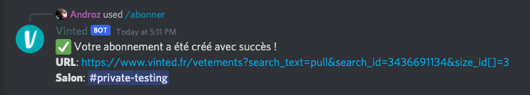
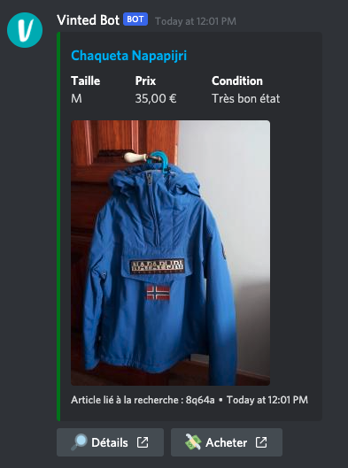

# Vinted Discord BOT

Un bot Discord pour Vinted, qui envoie un message lorsqu'une nouvelle annonce est publiée (selon certains critères).

## Distrobot.fr

Bien que le bot open source fonctionne parfaitement et soit très rapide, sa configuration et son installation peut être laborieuse. C'est pour cela que nous vous proposons également notre service https://distrobot.fr :

|                                             | **Bot open source** | **Distrobot** |
|---------------------------------------------|---------------------|---------------|
| Prix                                          | Gratuit                   |  à partir de 9.90€/mois             |
| Mises à jour régulières                     | ✅                   | ✅             |
| Recherches avancées                         | ✅                   | ✅             |
| Vitesse de synchronisation                  | 15s                 | < 5s            |
| En ligne 24/24 7/7                          |  ❌  (sauf VPS payant)                | ✅             |
| Utilisation de proxies (pour + de rapidité) |   ❌                  | ✅             |
| Configuration en 3 clics                    |   ❌                  | ✅             |
| Salons avec conseils de professionnels      |   ❌                  | ✅             |
| Soutien du projet                           |  ❌                   | ✅             |

## Abonnez-vous...

Pour s'abonner, entrez n'importe quelle URL Vinted. Le bot déterminera automatiquement les filtres à appliquer aux résultats.

### Détecter les bonnes affaires

`/abonner` accepte un paramètre optionnel `remise` (en %). Quand il est renseigné, le bot calcule le prix moyen des annonces actuellement visibles sur la recherche, et n'envoie une alerte que si une nouvelle annonce est au moins `remise`% moins chère que cette moyenne. L'embed affiche alors un champ **🔥 Bonne affaire** avec le pourcentage de réduction constaté.

Exemple : pour être alerté uniquement quand un article est au moins 70% moins cher que le prix moyen des articles similaires, utilisez `/abonner url:<recherche Vinted> channel:#bons-plans remise:70`.

Pour cibler un article précis (ex: un sweat Ralph Lauren habituellement à ~30€, en dessous de 4€), le plus fiable reste de construire la recherche Vinted avec les filtres marque + prix max directement sur vinted.fr, puis de s'y abonner (avec ou sans `remise` en complément).

## ...et recevez vos notifications !

## Installation

**Je maintiens bénévolement ce bot sur mon temps libre. Pour supporter ce projet, n'hésitez pas à [faire un don](https://paypal.com/andr0z). Si besoin, je suis également disponible pour aider pour l'installation sur [Twitter](https://twitter.com/androz2091) si besoin.**

Prérequis :

* Node.js
* NPM

Installation :

* Installer les dépendances avec `npm install`
* Renommer le fichier `config.sample.json` en `config.json`
* Lancer avec `node index.js`
